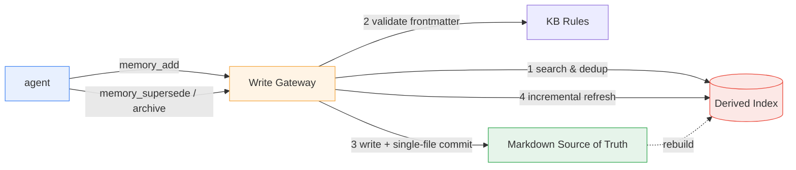
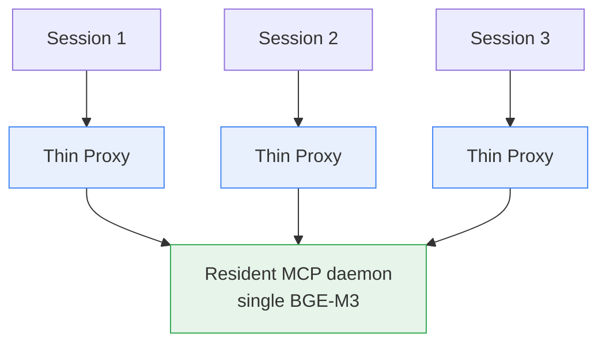

## Bottom line first

I built a **memory capability package** for coding agents: it can now semantically search my cross-project knowledge base through standard MCP tools, and it has a write path that is **structurally incapable of corrupting memory**.

What actually decided success wasn't a model or a particular piece of code. It was three principles:

1. **Remove irreversible operations from the tool surface.** Delete and in-place rewrite are never exposed to the agent, so safety becomes a structural constraint instead of a prompt-level one.
2. **Separate the source of truth from the derived index.** The truth is Markdown (diffable, revertible); the vector index is a disposable accelerator. If the index breaks, rebuild it.
3. **Turn every conclusion into a reproducible anchor.** When an AI writes the code, "looks right" is even less acceptable as an acceptance criterion.

The final deliverable: 163 unit tests passing, a write-path determinism suite at 25/25, a cross-session blind recall test passing, and a self-consistent index (135 entries = 135 vector points).

## 1. The problem: what an agent's "memory" is missing

I keep a personal Markdown knowledge base used across projects, plus three project repos. The problem: a coding agent can only grep through it. Two real pains follow.

**Retrieval is literal.** I stored "decision quality and Analysis of Competing Hypotheses (ACH)," then asked "how do I avoid making calls from the gut" — grep finds nothing. So the agent **re-derives conclusions it already recorded**, burning context and sometimes getting them wrong.

**Writes are unsafe.** Let an agent write Markdown directly and it might create duplicates, split one memory into five, overwrite an old conclusion in place, or just delete a file. The worst outcome for a knowledge base isn't "can't find it" — it's **quietly rotting**.

So the goal wasn't "another RAG." It was: reliable recall, plus a write entry point you can trust.

## 2. Shape: from "a RAG app" to "a capability package"

The original project was a policy-and-law Q&A RAG web app. After the upgrade it was reorganized into three modules:

```
ragcore/       reusable core (retrieval, vector store, document handling; zero web deps)
legal_web/     adapter instance / regression anchor (the original RAG web app)
memory_agent/  the hero: the memory capability package (MCP + skill)
```

Once the hero became a memory package, the old web app was demoted to "adapter + regression anchor": it must still boot and still be evaluable, proving the core wasn't broken. That's a great deal — **you always have a working old thing to compare against**.

## 3. Five core decisions

### 3.1 Markdown is the source of truth; the vector index is derived

```
writable memory   = Markdown entries in the global KB (frontmatter: id/type/tags/status/supersedes…)
read-only corpus  = Markdown docs from project repos (writable:false)
vector index      = a rebuildable, disposable accelerator over both
```

The semantics of memory are "versionable, revertible, human-readable." A database or vector store as primary storage can't give you `git log` for at-a-glance changes or `git revert` for one-command rollback. That decision saved the day repeatedly later: we hit a silent failure where "the index has 0 points but the manifest still lists 60 entries." Because the source of truth was intact, a rebuild was all it took.

### 3.2 The write gateway: no overwrite, no delete, no in-place edits

Only MCP tools are exposed; **no raw file write, ever**. Every write goes through a gateway:

```
search → dedup → validate(frontmatter) → write → git commit → incremental refresh
```

There are exactly two lifecycle semantics, and neither is "delete":

| Operation | Meaning | Effect on disk |
|---|---|---|
| `supersede` | An update with a replacement | New entry + old entry marked `superseded`, cross-referenced, in one commit |
| `archive` | A retirement with no replacement | `status: archived` + `archive_reason`, **file kept forever** |

Both are destructive, so by default `confirm=false` **returns a preview only**; nothing is written until the user explicitly agrees.

One more engineering detail: every write is a git commit that contains **only the files it touched**. Under concurrent sessions that matters — `git add -A` would sweep in some other session's work-in-progress.



### 3.3 Index consistency: generations plus an atomic pointer swap

A full rebuild is a long job (~6 minutes per 60 entries on CPU) and can be interrupted by a timeout, a kill, or a crash. The naive approach — clear the collection, then rebuild — leaves "**empty index + stale manifest**" if it dies midway: `get` works, `search` returns nothing, and you won't notice unless you check. We hit exactly that.

The current approach:

- Each full rebuild is written into a **new generation directory** `vector_db/gen-N/`;
- Only after it is complete and passes a **consistency check** (manifest count == point count) do we atomically swap the `CURRENT` pointer;
- An interruption leaves an unadopted generation directory; the old one keeps serving;
- Before serving a search we verify consistency and **raise loudly** if it fails — never a silent empty result.

### 3.4 One resident daemon plus a thin per-session proxy

This is the most "physical" decision in the project, and it was forced by an OOM.

Initially each opencode session spawned its own stdio MCP server, each loading its own BGE-M3 embedding model. The weights are 2.17GB, plus the torch runtime and load peak ≈ **3.9GB private memory per process**. Three parallel sessions ≈ 12GB, which exhausted system commit and produced `Out of memory`, hangs, and `uv_spawn` failures.



N sessions went from `N × 3.9GB` to `1 × 3.9GB + N × tens of MB`. Three more things came with it:

- The proxy must **start the daemon idempotently**. N sessions cold-starting simultaneously would each spawn a daemon (back to N models), so a **startup-ownership file lock** ensures only one process spawns while the rest just wait for health checks.
- Within one process, Qdrant local mode can't open a second client concurrently either, so a process-level lock serializes access.
- Warmup is **off by default**: startup private memory dropped from 3953MB to 54MB.

### 3.5 Read-only corpus: labeled documents across multiple repos

Finally, I brought three project repos' documents into retrieval. A few trade-offs:

- **Index `.md` only, never code.** Code is worthless for "recalling decisions" and only dilutes retrieval.
- **Don't hardcode the repo list.** The three repos are machine-local absolute paths; baking them into publishable code means "breaks on another machine, and leaks directory structure." Instead: a gitignored JSON list plus a committed example template, with an env override still available.
- **Prefix sources with `<label>/` to disambiguate.** All three repos have `README.md` and `CONTEXT.md`; bare relative paths make read-only entry ids collide, and de-duplication **silently drops** entries. Now sources look like `agent-infra/docs/adr/0007-....md`.
- **Exclude noise**: generated artifacts and tool caches never enter. One repo alone had 1339 markdown extraction outputs under `outputs/`; indexing all of them would be a disaster.

One constraint you must remember when changing config: **it is evaluated at import time, so restart the daemon after editing it.** Otherwise the daemon refreshes incrementally using stale read-only roots and deletes entries it thinks are orphans.

## 4. Six reusable scars

1. **stdio MCP: stdout is the protocol channel.** The underlying library's logger writes to `stdout` by default; one line corrupts JSON-RPC. You must grab the root logger and point it at stderr *before* importing it.
2. **Module names can shadow packages.** A `config.py` placed in the wrong spot shadowed another top-level `config` package in script mode. Renamed it and switched to consistently prefixed absolute imports.
3. **Two counterintuitive semantics of Qdrant local mode.** (a) The exclusive lock is held at client construction and released by `close()`, so don't hold a client long-term — open/close per operation (~19ms each, measured). (b) Dropping a collection and recreating it with the same name **resurrects** the old on-disk points — clear by deleting all points with an empty filter.
4. **"The command returned" ≠ success.** Kill the rebuild process and the command looks like it finished, but state is broken. Long jobs need background start + redirected output + independent progress polling + a consistency check at the end.
5. **Client timeout ≠ write failure.** An MCP client may time out at 20s while the server has already committed. After a timeout, check the source of truth — **don't retry** (a retry hits dedup and just returns `duplicate`).
6. **Calibrate the dedup threshold; don't guess it.** The first guess was 0.92. Measured on the real KB: nearest neighbors of distinct entries were ≤0.792, and exact re-adds started at 0.949 — so 0.88 sits in the middle of the gap.

## 5. Evidence, not vibes

The biggest risk with "AI-written code" is that it **looks right**. So we tried to turn every conclusion into a machine-verifiable anchor:

| Capability | Evidence |
|---|---|
| Core services | `pytest tests/unit` → **163 passed** |
| Write-path determinism | The sandbox suite (real KB clone + isolated index) → **25/25**, identical across two runs, real KB byte-identical before and after |
| Index consistency | `memory_index_status` → 135 entries = 135 points, `consistent=true` |
| Cross-session recall | Two independent channels (separate process + separate sub-agent) hit the same entry with the same paraphrase query and bit-identical score; that query had **0 grep hits** across the KB, proving semantic recall |
| Read-only corpus | 135 entries = 26 writable + 109 read-only docs across three repos; `supersede`/`archive` reject read-only entries outright |
| Regression anchor | Old RAG web boot smoke: ready, page and script 200, KB list and doc count correct, port and lock released on shutdown |

A few deliberate testing stances:

- **Assert external behavior only.** The sandbox checks tool responses, files on disk, git state, and spec-validation output — **never internal vector-store calls**. That way refactoring internals can't turn tests into tests-of-implementation.
- **Keep the real KB read-only.** The sandbox clones the committed state into a temp dir and proves with `git status` that the real KB is untouched.
- **Anchor discipline.** However the structure is refactored, the baseline anchors (unit tests + import smoke + boot smoke) must be reproducible every day.

## 6. Methodology: making AI development verifiable

The executor on this project was an AI (I supplied direction and made the calls; the AI wrote the code). The most valuable output wasn't any particular chunk of code — it was a set of disciplines that turn "AI productivity" into "verifiable results":

- **Route requests first**: defects go through a root-cause loop, features through a decision gate, experiments into `experiments/<name>/` (write the record before running; no conclusion means not done).
- **One unit = one commit**: commit any increment you can explain in one sentence and verify independently; don't hoard a giant commit.
- **Hard decisions get an ADR**: anything hard to reverse, counterintuitive, or a genuine trade-off goes into `docs/adr/`. This project has 14, covering every "why this choice."
- **If the same goal fails three times, stop and research** — don't retry in place.
- **Run a health gate at wrap-up**: clean git, docs matching the real tree, no junk files, experiments with conclusions, decisions with a home.

## Summary

The real output of this MVP isn't "a searchable memory store." It's three reusable things:

1. **Structural constraints beat prompt constraints.** Take delete and in-place rewrite off the tool surface, and the agent *can't* do harm.
2. **Separate the source of truth from the derived index.** Markdown owns correctness and revertibility; the index owns speed. The former must never break; the latter can always be rebuilt.
3. **A culture of evidence.** Unit tests, a deterministic sandbox, blind recall, consistency checks — every "done" needs a machine-verifiable anchor.

Next up: turning "how good is retrieval" from a feeling into a comparable number (BEIR subset nDCG@10), and optimizing the fusion of vector / keyword / anchor signals. But that's another story.
