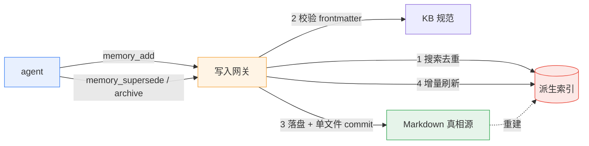
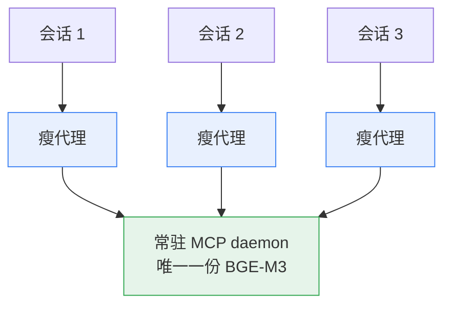

## 结论先行

我给 coding agent 造了一个**记忆能力包**：它现在可以通过标准 MCP 工具语义检索我的跨项目知识库，并且有一个**结构上不可能把记忆写坏**的写入口。

真正决定成败的不是某个模型或某段代码，而是三条原则：

1. **把不可逆的操作从工具面里拿掉**。删除、原地改写这类动作根本不暴露给 agent，安全性就成了结构约束，而不是提示词约束。
2. **把真相源和派生索引分开**。真相是 Markdown（可 diff、可回退），向量索引只是可随时丢弃的加速结构。索引坏了，重建即可。
3. **把每个结论都变成可复现的锚点**。写代码的是 AI，那就更不能用"看起来对"当验收标准。

最终交付：单测 163 通过、写路径确定性套件 25/25、跨会话盲测 recall 通过、索引自洽（135 条 = 135 个向量点）。

## 一、问题：agent 的"记忆"缺什么

我有一个跨项目使用的个人 Markdown 知识库，加上三个项目仓库。问题是：coding agent 只能靠 grep 去翻它。这带来两个真实的痛。

**检索是字面的。** 我记的是"决策质量与竞争性假设（ACH）"，问的是"怎么避免拍脑袋定方案"——grep 命中不了。agent 于是把已经记录过的结论**重新推导一遍**，浪费上下文，还可能推歪。

**写入是不安全的。** 让 agent 直接往 Markdown 里写，它可能写成重复条目、把一条记忆拆成五条、原地覆盖旧结论，甚至删文件。知识库最怕的不是搜不到，是**悄悄坏掉**。

所以目标不是"再做一个 RAG"，而是：让 agent 能可靠地回忆，并且有一个值得信任的写入口。

## 二、形状：从"一个 RAG 应用"变成"一个能力包"

原来的项目是一个政策法规问答的 RAG web。升级后重排成三个模块：

```
ragcore/       可复用核心（检索、向量库、文档处理，零 Web 依赖）
legal_web/     适配层实例 / 回归锚点（原来的 RAG web）
memory_agent/  hero：记忆能力包（MCP + skill）
```

把 hero 切成记忆能力包之后，原来的 web 退成"适配层 + 回归锚点"：它仍然必须能启动、能评测，用来证明核心没被改坏。这是很划算的一手——**你永远有一个跑得起来的旧东西当对照**。

## 三、五条核心决策

### 3.1 Markdown 是真相源，向量索引是派生物

```
可写记忆 = 全局知识库的 Markdown 条目（frontmatter: id/type/tags/status/supersedes…）
只读语料 = 项目仓库的 Markdown 文档（writable:false）
向量索引 = 从上面两者重建出来的、可随时丢弃的加速结构
```

记忆的语义是"可版本化、可回退、可人读"。数据库或向量库做主存，都做不到 `git log` 一眼看变更、`git revert` 一键回退。这个决定后面反复救了场：出过"索引 0 个点、但 manifest 还写着 60 条"的静默故障，因为真相源没丢，重建就完事。

### 3.2 写入网关：不覆盖、不删除、不原地编辑

对外只暴露 MCP 工具，**不暴露任何裸文件写**。写入必须过一次网关：

```
search → dedup → validate(frontmatter) → write → git commit → incremental refresh
```

生命周期语义只有两种，都不是"删除"：

| 操作 | 语义 | 落盘效果 |
|---|---|---|
| `supersede` | 有替代的更新 | 新建条目 + 旧条目置 `superseded`、互相指认，同一 commit |
| `archive` | 无替代的退役 | 置 `status: archived` + `archive_reason`，**文件永久保留** |

两者都是破坏性操作，默认 `confirm=false` **只返回预览**，用户明确同意后才落盘。

还有一条工程细节：每次写入 = **只包含本次触及文件**的一个 git commit。多会话并发时很关键——如果 `git add -A`，就会把别的会话正在编辑的脏文件一起提交进去。



### 3.3 索引一致性：代目录 + 指针原子切换

重建索引是长活（CPU 上约 6 分钟 / 60 条），中途会被超时、kill 或崩溃打断。朴素做法（清空集合再重建）如果中途死掉，就留下"**空索引 + 陈旧 manifest**"——`get` 照常、`search` 返回空，不核对根本发现不了。这个坑真实发生过。

现在的做法：

- 每次全量重建写在**新代目录** `vector_db/gen-N/`；
- 全部建好并通过**自洽核对**（manifest 条数 == 集合点数）后，原子切换 `CURRENT` 指针；
- 中断只留下一个没被接管的代目录，旧代继续服务；
- 检索前核对自洽性，不一致就**显式报错**，绝不静默返回空。

### 3.4 一个常驻 daemon + 每会话一个瘦代理

这是整个项目里最"物理"的决策，因为它由一次 OOM 逼出来。

最初每个 opencode 会话各拉起一份 stdio MCP，各加载一份 BGE-M3 嵌入模型。BGE-M3 权重 2.17GB + torch 运行时 + 加载峰值 ≈ **每进程 3.9GB 私有内存**。三条并行会话 = 约 12GB，直接把系统 commit 打满，结果是 `Out of memory`、卡死、`uv_spawn` 失败。



N 个会话的内存从 `N × 3.9GB` 降到 `1 × 3.9GB + N × 几十 MB`。配套还解决了三件事：

- 代理必须**幂等拉起** daemon。N 个会话同时冷启动会各自 spawn 一个 daemon（又回到 N 份模型），所以用**启动权文件锁**：只有一个进程负责拉起，其余只等健康检查。
- 同一进程内 Qdrant local mode 也不能并发开 client，于是用一个进程内锁把并发串行化。
- 默认**不预热**模型：启动私有内存从 3953MB 降到 54MB。

### 3.5 只读语料：带标签的多仓库文档

最后把三个项目仓库的文档也纳入检索。几个取舍：

- **只索引 `.md`，不索引代码**。代码对"回忆决策"没有价值，进语料只会稀释检索。
- **仓库清单不硬编码**。三个仓库是机器本地绝对路径，写进可发布代码就是"换机器即坏 + 泄露目录结构"。改成 gitignored 的 JSON 清单 + 一份 example 模板，环境变量仍可覆盖。
- **加 `<label>/` 前缀消歧义**。三个仓库都有 `README.md`、`CONTEXT.md`，裸相对路径会让只读条目 id 互撞，去重时**静默丢条**。现在来源是 `agent-infra/docs/adr/0007-....md` 这种带仓库名前缀的形式。
- **排除噪声**：生成物、工具缓存一律不进——其中一个仓库光 `outputs/` 就有 1339 个 markdown 抽取产物，全进索引就是灾难。

改配置有个必须记住的约束：**配置在 import 时求值，改完必须重启 daemon**。否则 daemon 拿着旧的只读根做增量刷新，会把"不在我语料里"的条目当孤儿删掉。

## 四、六个可复用的坑

1. **stdio MCP：stdout 就是协议通道。** 底层库的 logger 默认把日志写到 `stdout`，一行就能腐蚀 JSON-RPC。必须在 import 它**之前**把 root logger 抢配到 stderr。
2. **模块名会遮蔽包。** 把 `config.py` 放在了不该放的位置，结果在脚本模式下遮蔽了另一个顶层 `config` 包。改名 + 统一前缀绝对导入。
3. **Qdrant local mode 的两个反直觉语义。** (a) 独占锁在 client 构造期持有、`close()` 释放，所以不要长持 client，按操作开/关（实测约 19ms/次）；(b) 删集合后再用同名建集合，磁盘上的旧点会**复活**——清空集合要用空 filter 删光点。
4. **"命令返回了" ≠ 成功。** 重建进程被 kill，命令看起来正常结束，但状态是坏的。长活必须后台启动 + 输出重定向 + 独立轮询进度 + 完成后自洽核对。
5. **客户端超时 ≠ 写入失败。** MCP 客户端 20s 超时，但服务端可能已经 commit 成功。超时后要核对真相源，**不能直接重试**（重试会命中去重，只返回 `duplicate`）。
6. **去重阈值要校准，不要拍脑袋。** 最初拍 0.92，在真实知识库上量了一下：不同条目的最近邻相似度 ≤0.792，精确重加最低 0.949，于是改成 0.88 落在间隔中部。

## 五、证据，而不是感觉

"AI 写的代码"最大的风险是**看起来很对**。所以整个过程尽量把结论变成机器可验的锚点：

| 能力 | 证据 |
|---|---|
| 核心服务 | `pytest tests/unit` → **163 passed** |
| 写路径确定性 | 真实知识库克隆 + 隔离索引的 sandbox 套件 → **25/25**，两次运行一致，真实知识库前后逐字不变 |
| 索引一致性 | `memory_index_status` → 135 条 = 135 个点、`consistent=true` |
| 跨会话 recall | 独立进程 + 独立子代理两路盲测，同一句改写查询命中同一条、score 逐位相同；该查询关键词全库 grep **0 命中**，证明是语义召回 |
| 只读语料 | 三仓库 135 条 = 26 可写 + 109 只读文档；`supersede`/`archive` 对只读条目直接拒绝 |
| 回归锚点 | 旧 RAG web 启动冒烟：就绪、页面与脚本 200、知识库列表与文档数正确、退出后端口与锁释放 |

几个刻意的测试口径：

- **只断言外部行为**。sandbox 只检查工具返回值、落盘文件、git 状态、规范校验输出，**不碰内部向量库调用**。这样重构内部实现不会把测试改成"测实现"。
- **真实知识库只读**。sandbox 克隆已提交态到临时目录，跑完用 `git status` 证明真实知识库未变。
- **锚点纪律**。结构怎么重构，基准锚点（单测 + 导入冒烟 + 启动冒烟）必须每天可复现。

## 六、方法论：让 AI 开发可验证

这个项目的执行者是 AI（我提供思路和裁决，AI 写代码）。跑下来最有价值的不是某段代码，而是几条把"AI 生产力"变成"可验证结果"的纪律：

- **请求先进路由**：缺陷走根因流程、新功能走决策闸门、实验只进 `experiments/<name>/`（先写记录再跑，无结论不算完成）。
- **一个单元 = 一个 commit**：能一句话说清 + 能独立验证的增量就提交，不攒大提交。
- **硬决策必须留 ADR**：难逆转、反直觉、真权衡的，写进 `docs/adr/`。这个项目留了 14 篇，覆盖每一次"为什么这么选"。
- **同一目标失败三次就停手调研**，不要原地重试。
- **收工过健康闸门**：git 干净、文档与目录树一致、无垃圾文件、实验有结论、决策有落点。

## 总结

这个 MVP 真正的产出不是"一个能搜的记忆库"，而是三件可复用的东西：

1. **结构约束 > 提示词约束**。把删除、原地改写从工具面拿掉，agent 想做坏事也做不到。
2. **真相源与派生索引分离**。Markdown 负责正确与可回退，索引负责快；前者坏了不可接受，后者坏了重建即可。
3. **证据文化**。单测、确定性 sandbox、盲测 recall、自洽核对——每一个"完成"都要有机器可验的锚点。

下一步是把"检索有多好"从感觉变成可比数字（BEIR 子集 nDCG@10），以及向量 / 关键词 / 锚点的混合检索融合优化。但那是另一个故事了。
